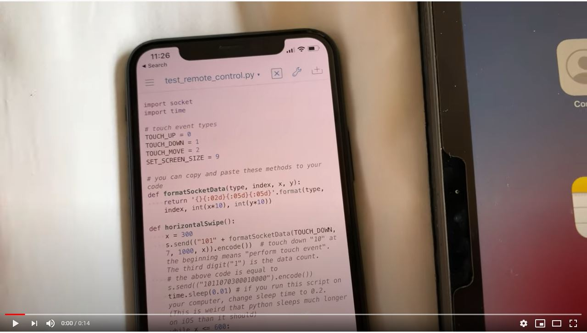
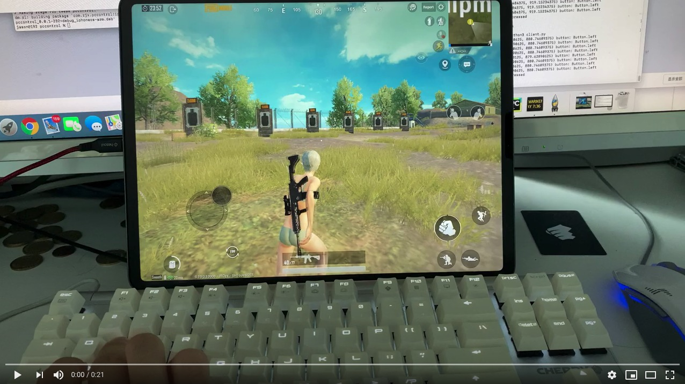
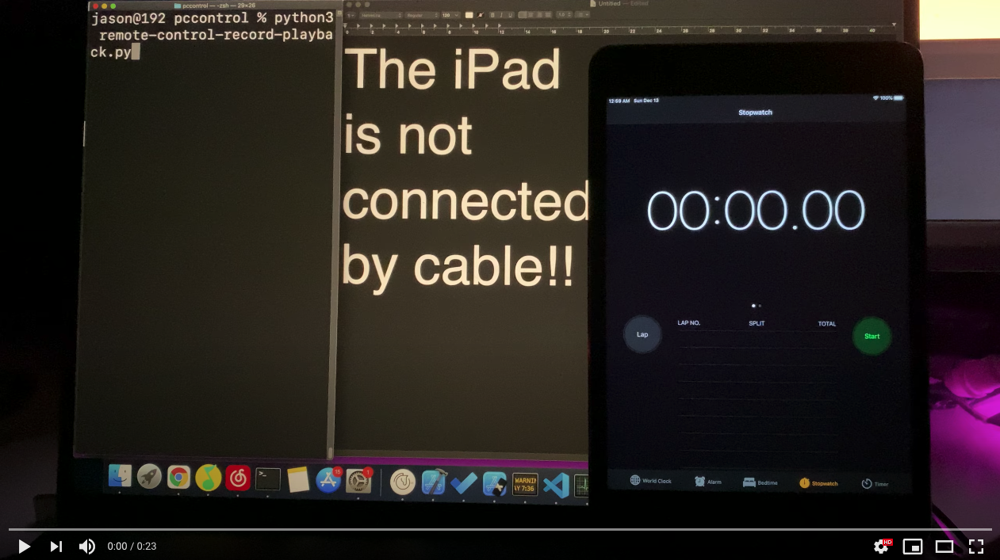

# ZXTouch 无根版（Rootless）

适用于 iOS 15 至 17 的 ZXTouch 无根版（rootless）与 roothide 移植版本，基于 [Epic0001](https://github.com/Epic0001/zxtouchrootless) 的移植工作。

这是一个 iOS 系统级的触摸模拟库：可以模拟点击与滑动、回放录制的操作、运行自动化脚本，**不需要注入到任何 App 进程中**。

原项目为 xuan32546 的 [IOS13-SimulateTouch](https://github.com/xuan32546/IOS13-SimulateTouch)。

本版本特点：**App、音量键控制面板、网页控制台、弹窗提示全部已汉化为简体中文**。

---

## 兼容性

| 越狱方式 | 系统版本 | 状态 |
|-----------|-----|--------|
| Roothide / Serotonin | 15.8、16.6.1 | 可用 |
| Dopamine（rootless，多巴胺） | 16.4.1、16.6.1 | 可用 |
| NathanLR（rootless，半不完美越狱） | 16.5.1 至 16.6.1 | 可用，请安装 `_rootless.deb` |
| Dopamine 3（rootless） | 17.0 至 17.7 | 可用，已在 17.6 上测试 |
| Dopamine 3（rootless） | 18.x | 未测试 |

iOS 17 在第 7 代 iPad（系统 17.6，Dopamine 3 + ElleKit）上测试通过。

iOS 18 尚未测试。由于 Dopamine 3 使用相同的引导目录结构，同一个无根版安装包理论上可以安装，但 18 上的任何功能都未经证实。欢迎在 Issues 中反馈。

---

## 本版本相对原版的改动

相比原始 ZXTouch：

- 在 iOS 15 至 17 上以 rootless（Dopamine、Dopamine 3、NathanLR）和 roothide（Serotonin）方式运行
- `image_match`（图像匹配）基于 `Accelerate.framework` 重写，不再依赖 OpenCV，安装包更小
- 取色器、颜色搜索、文字识别（OCR）、按音量下键停止等功能恢复正常
- Python 脚本自动识别 Procursus 的 Python 3.8 至 3.12，优先使用带版本号的解释器，并能输出真实的错误回溯
- 新增重制的控制面板与脚本浏览器、深色模式、录制编辑器、远程网页面板、iOS 快捷指令操作、按键组合自动触发
- 「脚本完成」弹窗可以在「设置 → 脚本」中关闭
- **本仓库额外修复**：面板指令缺少 `\r\n` 导致网页控制台「连接无效」的问题；中文脚本名无法运行的编码问题；播放指示器异常可能导致 SpringBoard 进入安全模式的问题；全界面中文汉化

---

## 运行环境

所有越狱方式下，运行 `.py` 脚本都需要 Procursus 提供的 Python 3。请在 Sileo 中搜索 `python3` 安装。ZXTouch 不再自带运行时：旧版内置的 `python3.7` 在无根越狱上会因动态库路径不存在而启动失败。

Dopamine 与 Dopamine 3（rootless）：

- iOS 15.0 至 17.7
- [Dopamine](https://ellekit.space/dopamine/)，iOS 17 请使用 Dopamine 3

NathanLR（rootless，iOS 16.5.1 至 16.6.1）：

- 属于半不完美越狱，每次重启后需要重新打开 [NathanLR](https://www.nathanlr.com/) App 激活插件
- 请安装 `_rootless.deb`，因为 NathanLR 使用 `/var/jb` 下的 rootless 引导，而不是 roothide

Roothide 与 Serotonin：

- iOS 15.0 至 16.6.1
- [Serotonin](https://github.com/roothide/Serotonin) 或其他兼容 roothide 的越狱

---

## 安装方法

### 方法一：从 Releases 下载

1. 从 [Releases](https://github.com/xiaoxing12138/zxtouch-rootless/releases) 下载最新的 `.deb`：Dopamine 和 NathanLR 用 `*_rootless.deb`，Roothide 和 Serotonin 用 `*_roothide.deb`
2. 用 Filza 安装，或通过 SSH 安装：

```sh
dpkg -i <文件>.deb && killall -9 SpringBoard
```

### 方法二：从 GitHub Actions 下载最新构建

1. 打开 [Actions](https://github.com/xiaoxing12138/zxtouch-rootless/actions)
2. 点开最近一次成功的构建
3. 下载 `ZXTouch-rootless-deb`（Dopamine 用）或 `ZXTouch-roothide-deb` 产物

---

## 演示视频（原版）

远程控制：
[](https://youtu.be/gdSGO6rJIL4)

实时控制（PUBG 手游）：
[](https://youtu.be/XvvWHL6B3Tk)

录制与回放：
[](https://youtu.be/WeYMx4z8N2M)

演示 4：[文字识别 OCR](https://youtu.be/xt4BvgsSGkc)

演示 5：[触点指示器](https://youtu.be/AU7zG_-W2tM)

演示 6：[取色器](https://youtu.be/tserB05_B9E)

---

## 使用方法

安装后，插件会监听 **6000** 端口。你可以用任何编程语言按规定格式发送指令，也可以直接使用内置的 Python 客户端。

### 控制面板（音量键唤起）

**双击音量下键**即可打开或关闭控制面板。

- 点按脚本：立即运行
- 先打开设置（齿轮按钮）：可以在运行前设置重复次数、播放速度、运行间隔
- 「录制」：开始录制触摸操作
- 「停止」：结束当前正在进行的录制或脚本
- 「设置 → 深色模式」：同时切换 App 和控制面板的深色主题

### 脚本与示例

示例脚本随 `.deb` 安装在 `/var/mobile/Library/ZXTouch/scripts/examples/`。

App 的脚本注册表位于 `/var/mobile/Library/ZXTouch/config/tweak/script_registry.plist`，用于保存脚本元数据、图标、说明预览和触发脚本选择。

### 录制编辑器

点按一个入口文件为录制文件（raw）的 `.bdl` 包，即可打开时间线编辑器。在编辑器中可以：

- 点按任意步骤，编辑坐标、延迟、悬浮提示文字、应用包标识符或原始指令
- 在编辑模式下调整步骤顺序
- 滑动步骤进行复制，或删除不需要的步骤
- 插入轻点、滑动、等待、悬浮提示、启动应用
- 保存录制并立即播放编辑后的结果

### 远程网页面板

在 App 中打开「设置 → 服务器（网页服务器）」，点按面板地址那一行即可复制专属访问地址。在同一 Wi-Fi 下的手机、平板或电脑浏览器中打开该地址。

- 脚本：搜索和筛选脚本库、运行/停止脚本、下载入口文件、控制录制
- 素材：把图像匹配模板等文件上传到指定的脚本包中
- 日志：查看、筛选、复制、导出或清空运行输出
- 设备：实时显示服务状态、屏幕尺寸、方向、电量、前台应用和服务器诊断信息

地址中包含私人访问令牌，请勿分享给局域网以外的人。网页面板运行在 SpringBoard 中，因此即使关闭 ZXTouch App，面板依然可以访问。

### 自动触发

在 App 中打开「设置 → 自动操作」，可以为按键组合分配动作。音量加、音量减、主屏幕按钮都可以设置为 1 至 5 次连击，触发：智能切换、显示/隐藏控制面板、终止脚本、开始/停止录制，或运行指定的 `.bdl` 脚本。

---

## Python 接口文档

### 安装

在 iOS 设备上，ZXTouch 的 Python 模块随 `.deb` 一起安装。

在电脑上进行远程控制时，请将原版仓库中的 `zxtouch` 文件夹复制到你电脑 Python 的 `site-packages` 目录：[`layout/usr/lib/python3.7/site-packages`](https://github.com/xuan32546/IOS13-SimulateTouch/tree/0.0.6/layout/usr/lib/python3.7/site-packages)。

### 创建 ZXTouch 实例

```python
from zxtouch.client import zxtouch
device = zxtouch("127.0.0.1")  # 远程控制时填写设备的 IP 地址
```

---

## 实例方法一览

| 方法 | 状态 |
|--------|--------|
| `touch` / `touch_with_list` | 可用 |
| `switch_to_app` | 可用 |
| `show_alert_box` | 可用 |
| `prompt_input` | 可用 |
| `run_shell_command` | 可用 |
| `show_toast` | 可用 |
| `pick_color` | 可用 |
| `search_color` | 可用 |
| `accurate_usleep` | 可用 |
| `play_script` / `force_stop_script_play` | 可用 |
| `get_screen_size` / `get_screen_orientation` / `get_screen_scale` | 可用 |
| `get_device_info` / `get_battery_info` | 可用 |
| `start_touch_recording` / `stop_touch_recording` | 可用 |
| `ocr` / `get_supported_ocr_languages` | 可用 |
| `image_match` | 可用（基于 Accelerate.framework，无需 OpenCV） |
| `screenshot` | 可用（直接通过 TCP 返回内存中的 JPEG 数据） |
| `insert_text` / `show_keyboard` / `hide_keyboard` / `move_cursor` | 可用（通过 appdelegate 插件） |

---

## 触摸操作

两种发送触摸事件的方法。

```python
def touch(type, finger_index, x, y):
	"""执行一次触摸事件

	参数：
		type: 触摸事件类型，从 zxtouch.touchtypes 导入
		finger_index: 手指编号 1-19
		x: x 坐标
		y: y 坐标
	"""
```

```python
def touch_with_list(self, touch_list: list):
    """同时执行多个触摸事件

    参数：
    	touch_list: [{"type": 类型, "finger_index": 手指编号, "x": x, "y": y}, ...]
    """
```

代码示例：

```python
from zxtouch.client import zxtouch
from zxtouch.touchtypes import *
import time

device = zxtouch("127.0.0.1")

device.touch(TOUCH_DOWN, 5, 400, 400)
time.sleep(1)
device.touch(TOUCH_MOVE, 5, 400, 600)
time.sleep(1)
device.touch(TOUCH_UP, 5, 400, 600)
time.sleep(1)

# 多点触控
device.touch_with_list([
    {"type": TOUCH_DOWN, "finger_index": 1, "x": 300, "y": 300},
    {"type": TOUCH_DOWN, "finger_index": 2, "x": 500, "y": 500}
])
time.sleep(1)
device.touch_with_list([
    {"type": TOUCH_UP, "finger_index": 1, "x": 300, "y": 300},
    {"type": TOUCH_UP, "finger_index": 2, "x": 500, "y": 500}
])

device.disconnect()
```

---

## 将应用切换到前台

```python
def switch_to_app(bundle_identifier):
	"""将指定应用切换到前台

	参数：
		bundle_identifier: 应用的包标识符（例如 "com.apple.springboard"）

	返回：
		结果元组 (是否成功, 错误信息或空)
	"""
```

---

## 显示提示框

```python
def show_alert_box(title, content, duration):
    """显示一个系统级提示框

    参数：
        title: 提示框标题
        content: 提示内容
        duration: 自动关闭前的秒数（0 = 只能手动关闭）

    返回：
        结果元组 (是否成功, 错误信息或空)
    """
```

---

## 弹出输入框

```python
def prompt_input(title, message="", placeholder="", default_value="", secure=False):
    """显示原生输入对话框并返回输入的文本

    参数：
        title: 对话框标题
        message: 输入框上方的可选提示文字
        placeholder: 输入框的可选占位文字
        default_value: 可选的初始值
        secure: 为 True 时隐藏输入内容，适用于密码

    返回：
        结果元组。成功时 result[1] 为输入的字符串。
        点取消返回 (False, 错误信息或空)。
    """
```

代码示例：

```python
from zxtouch.client import zxtouch

device = zxtouch("127.0.0.1")
success, value = device.prompt_input(
    "搜索",
    "脚本要查找什么内容？",
    placeholder="请输入关键词"
)

if success:
    device.show_toast(0, "你输入了：" + value, 2)
```

---

## 以 root 身份运行 Shell 命令

```python
def run_shell_command(command):
    """以 root 身份运行 Shell 命令

	参数：
    	command: Shell 命令字符串

    返回：
        结果元组 (是否成功, 错误信息或空)
    """
```

---

## 图像匹配

```python
def image_match(template_path, acceptable_value=0.8, max_try_times=2, scaleRation=0.8):
    """使用归一化互相关在屏幕上匹配模板图片

	参数：
    	template_path: 设备上模板图片的绝对路径
    	acceptable_value: 相似度阈值（0-1）
    	scaleRation: 每次重试的缩放系数
    	max_try_times: 最多尝试的缩放版本数量

    返回：
        结果元组。成功时 result[1] 为字典：{"x", "y", "width", "height"}
        未找到匹配时返回 (False, 错误信息)
    """
```

基于 `Accelerate.framework` 实现，无需安装 OpenCV。

---

## 悬浮提示（Toast）

```python
def show_toast(toast_type, content, duration, position=0, fontSize=0):
	"""显示一条悬浮提示

	参数：
        toast_type: TOAST_SUCCESS / TOAST_ERROR / TOAST_WARNING / TOAST_MESSAGE
        content: 要显示的文字
        duration: 显示时长（秒）
        position: TOAST_TOP（默认，顶部）或 TOAST_BOTTOM（底部）

	返回：
        结果元组 (是否成功, 错误信息或空)
	"""
```

---

## 取色器

```python
def pick_color(x, y):
    """获取屏幕上某个像素的 RGB 值

	参数：
   		x: x 坐标
    	y: y 坐标

    返回：
        结果元组。成功时 result[1] 为 {"red", "green", "blue"}（值为字符串）
    """
```

---

## 颜色搜索

```python
def search_color(region, red_min, red_max, green_min, green_max, blue_min, blue_max, pixel_to_skip=0):
    """在屏幕区域内搜索指定颜色

    参数：
        region: (x, y, 宽度, 高度) 元组
        red_min/red_max: 红色通道范围（0-255）
        green_min/green_max: 绿色通道范围（0-255）
        blue_min/blue_max: 蓝色通道范围（0-255）
        pixel_to_skip: 每次检查之间跳过的像素数（0 = 逐像素检查）

    返回：
        结果元组。成功时 result[1] 为 {"x", "y", "red", "green", "blue"}
    """
```

---

## 精确等待

```python
def accurate_usleep(microseconds):
    """等待指定的精确时长

	参数：
    	microseconds: 等待时间，单位微秒

    返回：
        结果元组 (是否成功, 错误信息或空)
    """
```

---

## 运行脚本

```python
def play_script(script_absolute_path):
    """运行一个 ZXTouch 脚本（.bdl 文件夹）

	参数：
    	script_absolute_path: .bdl 脚本文件夹的绝对路径

    返回：
        结果元组 (是否成功, 错误信息或空)
    """
```

---

## 强制停止脚本运行

```python
def force_stop_script_play():
    """强制停止当前正在运行的脚本

    返回：
        结果元组 (是否成功, 错误信息或空)
    """
```

---

## 收起键盘

键盘正在显示时将其收起。

```python
def hide_keyboard():
    """收起键盘

    返回：
        结果元组 (是否成功, 错误信息或空)
    """
```

---

## 显示键盘

键盘已收起时将其显示。

```python
def show_keyboard():
    """显示键盘

    返回：
        结果元组 (是否成功, 错误信息或空)
    """
```

---

## 文本输入

向当前输入框中插入文本。使用 `"\b"` 可以删除一个字符。

```python
def insert_text(text):
    """向获得焦点的输入框插入文本

    参数：
        text: 要插入的文本（\b = 退格/删除）

    返回：
        结果元组 (是否成功, 错误信息或空)
    """
```

---

## 移动光标

```python
def move_cursor(offset):
    """移动文本光标

    参数：
        offset: 移动的相对位置。
                负数 = 向左移动，正数 = 向右移动。

    返回：
        结果元组 (是否成功, 错误信息或空)
    """
```

---

## 获取屏幕尺寸

```python
def get_screen_size():
    """获取屏幕像素尺寸

    返回：
        结果元组。成功时 result[1] 为 {"width", "height"}
    """
```

---

## 截图

`screenshot()` 直接通过现有的 ZXTouch TCP 连接返回当前屏幕的原始 JPEG 字节数据。不会在 iOS 设备上创建文件，也不需要 SSH。Pillow 是可选项，只有当你自己的代码需要解码返回的 JPEG 时才需要安装。

```python
from io import BytesIO

from PIL import Image
from zxtouch.client import zxtouch

device = zxtouch("192.168.2.86")

data = device.screenshot()

image = Image.open(BytesIO(data))
image.load()
image.show()

device.disconnect()
```

网络响应格式为 `0;;image/jpeg;;<内容长度>\r\n`，随后紧跟恰好「内容长度」字节的原始 JPEG 数据。服务端错误仍为 `-1;;<错误信息>\r\n` 形式的文本响应。

---

## 获取屏幕方向

```python
def get_screen_orientation():
    """获取当前屏幕方向

    返回：
        结果元组。成功时 result[1] 为表示方向的数字字符串。
        1 = 竖屏（Home 键在下），2 = 竖屏（Home 键在上），3 = 横屏向左，4 = 横屏向右
    """
```

---

## 获取屏幕缩放比例

```python
def get_screen_scale():
    """获取屏幕缩放系数（Retina 屏通常为 2.0）

    返回：
        结果元组。成功时 result[1] 为浮点数字符串。
    """
```

---

## 获取设备信息

```python
def get_device_info():
    """获取设备信息

    返回：
        结果元组。成功时 result[1] 为：
        {"name", "system_name", "system_version", "model", "identifier_for_vendor"}
    """
```

---

## 获取电池信息

```python
def get_battery_info():
    """获取电池信息

    返回：
        结果元组。成功时 result[1] 为：
        {"battery_state", "battery_level", "battery_state_string"}
    """
```

---

## 开始触摸录制

```python
def start_touch_recording():
    """开始录制触摸事件
    录制期间屏幕顶部会出现一个绿点。

    返回：
        结果元组 (是否成功, 错误信息或空)
    """
```

---

## 停止触摸录制

```python
def stop_touch_recording():
    """停止录制触摸事件
    也可以双击音量下键停止。

    返回：
        结果元组 (是否成功, 错误信息或空)
    """
```

---

## 文字识别（OCR）

```python
def ocr(self, region, custom_words=[], minimum_height="", recognition_level=0, languages=[], auto_correct=0, debug_image_path=""):
    """识别屏幕指定区域内的文字

    参数：
        region: (x, y, 宽度, 高度) 元组
        custom_words: 补充识别的自定义词汇
        minimum_height: 文字相对图片高度的最小高度（默认 1/32）
        recognition_level: 0 = 精确，1 = 快速
        languages: 按优先级排列的语言代码列表（默认：英文）
        auto_correct: 0 = 关闭，1 = 开启
        debug_image_path: 调试图片的保存路径（留空则不保存）

    返回：
        结果元组。成功时 result[1] 为识别出的文字字符串列表。
    """
```

```python
def get_supported_ocr_languages(self, recognition_level):
    """获取 OCR 支持的语言列表

    参数：
        recognition_level: 0 = 精确，1 = 快速

    返回：
        结果元组。成功时 result[1] 为语言代码列表。
    """
```

---

## 从源码构建

每次向 `main` 分支推送都会触发 GitHub Actions 构建：macOS 运行器用 Xcode 编译 App，Theos 编译插件，两个 `.deb` 文件都会作为构建产物上传，因此你不需要拥有 Mac。

详见 [`.github/workflows/build.yml`](.github/workflows/build.yml)。

---

## 致谢

| 贡献 | 作者 |
|--|--|
| iOS 15 至 17 的 rootless 与 roothide 移植 | [Epic0001](https://github.com/Epic0001) |
| ZXTouch 原作者 | [xuan32546](https://github.com/xuan32546) |
